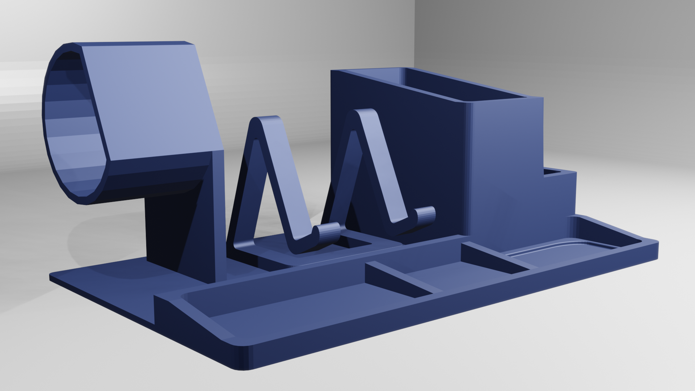

# 3D Printer Desk Organizer

## Overview

This project consists of a 3D printable desk organizer designed in Blender. The purpose of the organizer is to provide a functional and aesthetically pleasing solution for organizing desk accessories and stationery items.

## Features

- Multiple compartments for pens, pencils, and other stationery.
- Designed with ease of 3D printing in mind.
- Customizable dimensions to fit different desk sizes.
- Stylish and modern look.

## Getting Started

### Prerequisites

- 3D printer
- Blender software installed
- PLA or other suitable filament for 3D printing

### Printing Instructions

1. Download the STL file from the [releases](desk_organizer.stl) section.
2. Load the STL file into your 3D printing software like cura.
3. Adjust print settings (layer height, infill, etc.) based on your printer's specifications.
4. Start the 3D printing process.

## Customization

The Blender project file is included in the repository, allowing you to customize the design based on your preferences. Feel free to experiment with dimensions, shapes, and additional features.

## Contributing

If you'd like to contribute to the project, please follow these steps:

1. Fork the repository.
2. Create a new branch for your feature (`git checkout -b feature/new-feature`).
3. Commit your changes (`git commit -m 'Add new feature'`).
4. Push to the branch (`git push origin feature/new-feature`).
5. Open a pull request.

## License

This project is licensed under the [MIT License](LICENSE).